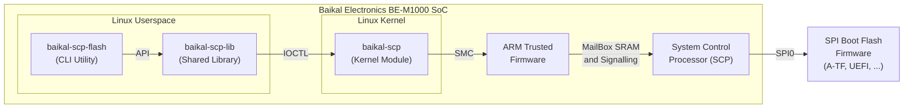

# baikal-scp-tool

Utility and driver for interacting with Baikal Electronics BE-M1000 SoC Boot SPI Flash from Linux userspace. The interaction diagram is shown in the figure below.



This repository contains sources for the following components:
- baikal-scp — Linux kernel module which interacts with A-TF using SMC calls that provides access to the SPI Boot flash;
- baikal-scp-lib — Linux userspace shared library for interacting with baikal-scp kernel module using IOCTL;
- baikal-scp-flash — Linux userspace CLI utility for flashing SPI Boot Flash using baikal-scp-lib shared library API.

## Requirements

For successful use of this utility and driver, the A-TF and UEFI firmware from the [Baikal ARM64 SDK](https://www.baikalelectronics.ru/products/238/) version 5.4 (20220126) or higher is required. Follow the instructions from the SDK to update the firmware on your board.

You can use this utility and the driver with older firmware versions (at least version 5.1), but in this case you should use an explicit offset specifying for the SPI flash memory (option `-o`, `--offset`) for the read/write/erase operations, instead of specifying the partition name (option `-p`, `--part`). The built-in flash offsets for named partitions are only valid for firmware version 5.4 or higher.

## Usage

Usage syntax:

```text
baikal-scp-flash [options]
```

Where `[options]` is a one or more options that are described in the "[Options](#options)" section.

## Options

### Option `-w`, `--write <filepath>`

Write image to SPI Boot Flash from file `<filepath>`. You can select SPI Boot Flash offset by built-in named partition (option `-p`, `--part`) or manually specify flash offset (option `-o`, `--offset`) and write size (option `-s`, `--size`). Also you can skip specified amount of bytes from the beginning of input image file using the skip option (`-k`, `--skip`).

The following steps will be performed sequentially when performing the write operation:
1. erase flash memory area;
2. writing data to flash memory;
3. read back and verify written data with the original data (if the `-n` option is not specified).

### Option `-r`, `--read <filepath>`

Read SPI Boot Flash contents to file `<filepath>`. You can select SPI Boot Flash offset by built-in named partition (option `-p`, `--part`) or manually specify flash offset (option `-o`, `--offset`) and read size (option `-s`, `--size`).

### Option `-e`, `--erase <filepath>`

Erase SPI Boot Flash contents. You can select SPI Boot Flash offset by built-in named partition (option `-p`, `--part`) or manually specify flash offset (option `-o`, `--offset`) and erase size (option `-s`, `--size`).

### Option `-p`, `--part <partition>`

Select SPI Boot Flash offset and size by built-in named partition for read (option `-r`, `--read`), write (option `-w`, `--write`) or/and erase (option `-e`, `--erase`) operations. This option automatically sets the size (option `-s`, `--size`) and offset (`-o`, `--offset`) to values corresponding to the selected flash partition by name.

Available built-in partitions:

| Partition Name | Offset   | Size                | Description                      |
| -------------- | -------- | ------------------- | -------------------------------- |
| `bl1`          | 0x000000 | 0x040000 (256 KiB)  | ARM Trusted Firmware (BL1)       |
| `dtb`          | 0x040000 | 0x040000 (256 KiB)  | Flattened Device Tree Blob (DTB) |
| `var`          | 0x080000 | 0x0c0000 (768 KiB)  | EFI variables                    |
| `fip`          | 0x140000 | 0x640000 (6400 KiB) | Firmware Image Package (FIP)     |

**Important:** The offsets and sizes in the table above are valid only for [Baikal ARM64 SDK](https://www.baikalelectronics.ru/products/238/) firmware version 5.4 or higher.

### Option `-s`, `--size <size>`

Specify size for read (option `-r`, `--read`), write (option `-w`, `--write`) or erase (option `-e`, `--erase`) operations. The specified size is automatically up-aligned to the 32-byte boundary.

### Option `-o`, `--offset <offset>`

Specify SPI Boot Flash offset for read (option `-r`, `--read`), write (option `-w`, `--write`) or erase (option `-e`, `--erase`) operations. The specified size is automatically up-aligned to the 32-byte boundary.

### Option `-k`, `--skip <bytes>`

The number of bytes to skip at the beginning of the input file during a write (option `-w`, `--write`) operation.

### Option `-n`, `--no-verify`

Do not read and verify the written data with the original data during the write (option `-w`, `--write`) operation.

### Option `-y`, `--yes`

Automatically confirm destructive operations (write, erase) without displaying a prompt.

### Option `-q`, `--quiet`

Be quiet. Do not output any messages to the standard output (stdout) except the destructive operation confirmation prompt (unless the `-y` option is specified).

### Option `-h`, `--help`

Show help and usage text.

### Option `-v`, `--version`

Display information about utility, shared library and kernel module versions.

## Examples

Write flattened device tree blob (DTB) to SPI Boot Flash from update.dtb file:

```
# baikal-scp-tool -w update.dtb -p dtb
```

Read full SPI Boot Flash contents to flash.bin file:

```
# baikal-scp-tool -r flash.bin
```

Erase 256 KiB on SPI Boot Flash at 8 MiB offset:

```
# baikal-scp-tool -e -s 0x40000 -o 0x800000
```

Write a block of 768 KiB from flash.bin file to SPI Boot Flash memory at 256 KiB offset, skipping the first 512 KiB of the file:

```
# baikal-scp-tool --write flash.bin --size 0xc0000 --offset 0x40000 --skip 0x80000
```

See this illustration:


## License

This work is free. You can redistribute it and/or modify it under the terms of the MIT License.

## Authors

*   Anton Kikin <mailto:a.kikin@tano-systems.com>
